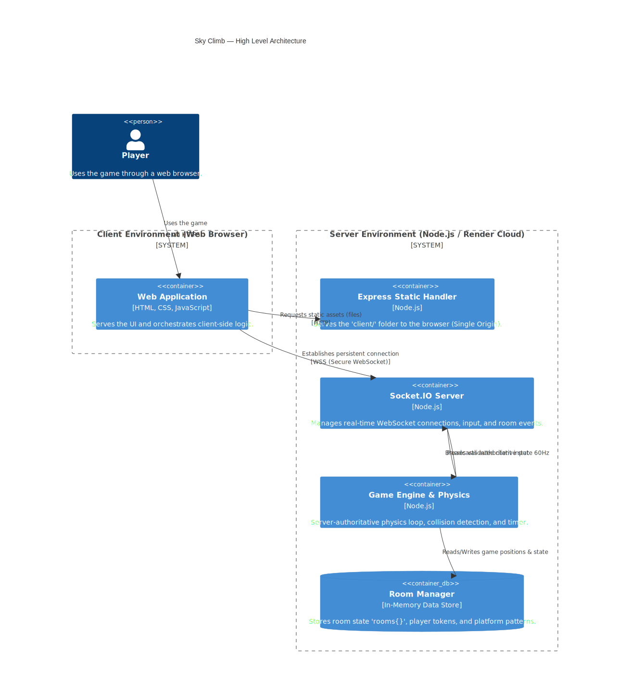
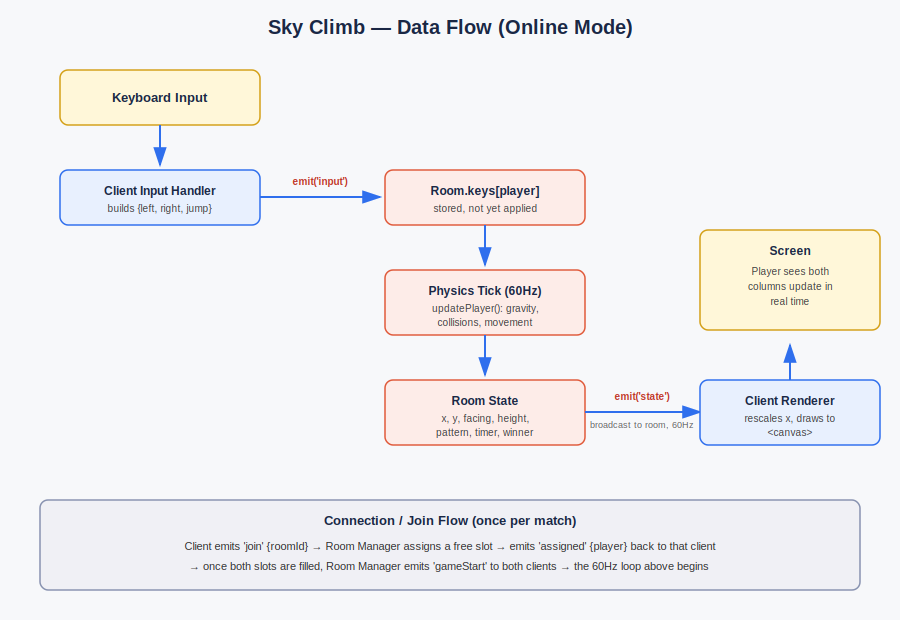
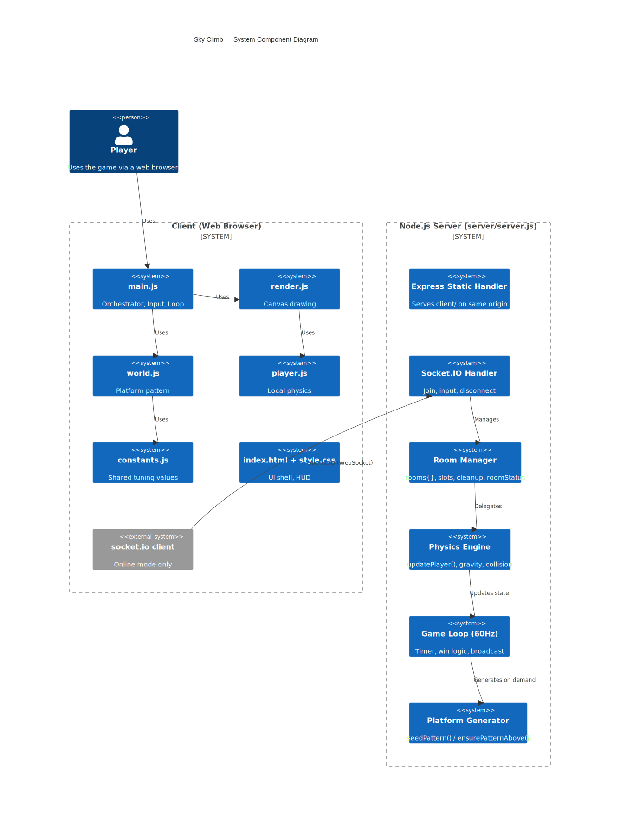

# Architecture

**Status:** Phase 6 (Security Architecture)
**Scope:** Sky Climb's client-server design as of the completed networking + Phase 5 remediation work.

This document captures how Sky Climb is actually built, with an emphasis on the decisions that matter for security: where the trust boundaries sit, what data crosses them, and where authority for game-critical logic actually lives. Diagrams live in `docs/diagrams/` as standalone SVGs, and each one gets explained below.

---

## 1. High-Level Architecture

Two halves: a browser client that captures input and renders whatever it's told, and a Node.js server that owns the actual game. The server does double duty — it serves the static client files (Express) *and* runs the real-time game over the same connection (Socket.IO) — which was a deliberate choice made in Phase 2 to avoid a second deployment target, a separate CORS configuration, and a hardcoded server URL in the client.

The client is intentionally "dumb" for anything that matters: it has no physics of its own in Online mode, no authority over its own position, and no way to report a score the server didn't calculate.

## 2. Data Flow

Two flows worth distinguishing:

- **Connection flow** (happens once per match): `join` → slot assignment → `assigned` → (once both slots fill) `gameStart`.
- **Gameplay flow** (happens 60 times per second once a match is running): client input → server physics tick → server broadcasts the full state → client renders it.

The important asymmetry: the client emits a tiny, fixed-shape packet (three booleans); the server emits everything else. There's no path in this diagram where the client sends anything that gets treated as fact about its own position or score.

## 3. Trust Boundary

This is the diagram that matters most for the security case study. Two zones:

- **Untrusted (client):** capture input, render pixels, display HUD text. Assume this code could be modified, replaced with a bot, or run through devtools directly emitting socket events — because it can be.
- **Trusted (server):** the only place position, physics, score, timer, and win logic exist. Nothing the client sends is ever treated as authoritative about game state, only about *intent* (which direction to move, whether to jump).

This boundary is what made the Phase 5 risk audit tractable — most of the "can the client cheat?" questions had a fast, confident answer, because the boundary had already been drawn correctly during Phase 4 rather than being retrofitted afterward.

## 4. Component Diagram

The client is already split by concern (`render.js`, `world.js`, `player.js`, `constants.js`, orchestrated by `main.js`) — a Phase 1 deliverable that's paid off by making the Online/Local mode split in `main.js` straightforward to reason about, since both modes reuse the same rendering and constants.

The server, by contrast, is still one file. The logical components are there (Express handler, Socket.IO handler, room manager, physics engine, game loop) but they're not yet physically separated into modules. That's flagged deliberately here rather than fixed now — it's a reasonable target for Phase 8, once secure-coding controls need to be added to specific components and having them in separate files will make that easier to test in isolation.

## 5. Network / Deployment View

This is local-only for development right now; the diagram describes the target shape for Phase 11. One thing to flag ahead of that phase: room state lives entirely in the Node process's memory (`rooms{}`), not in an external database. That's fine for a single-instance deployment, but it's a real constraint — the deployment can't be horizontally scaled across multiple server instances without also adding shared state (e.g. Redis) for room data, since two instances wouldn't see each other's rooms at all.

---

## Summary of architectural decisions so far

| Decision | Rationale |
|---|---|
| Single origin serves both static client and WebSocket | Avoids CORS complexity and hardcoded URLs; one deployment target |
| Server-authoritative physics, score, timer, win logic | Client cannot affect outcomes regardless of what it sends (see Trust Boundary) |
| Client sends only `{left, right, jump}` | Minimizes the attack surface of the one channel the client controls |
| In-memory room state, no database | Appropriate for current single-instance scale; documented as a scaling constraint, not an oversight |
| Server remains a single file for now | Logical separation exists; physical separation deferred to Phase 8 where it earns its cost |
